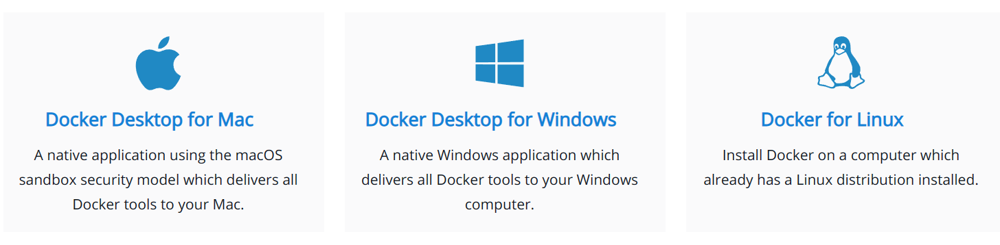

### Docker Flavours
🍦

^^^^^^

### 🍦Docker flavours 🍦

<!-- .element: class="plain" -->

Fuente: [Documentación de Docker](https://docs.docker.com/get-docker/)

notes:

En el año 2021, Docker pasó a un modelo de suscripción en un intento de monetizar
su producto estrella: Docker for Desktop.

A finales de 2021, se sabe que se está desarrollando una versión para Linux de
la aplicación Docker for Descktop:
* https://www.docker.com/blog/accelerating-new-features-in-docker-desktop/
* Se puede acceder a ella a través del 
  [Docker Developer Preview Program](https://www.docker.com/community/get-involved/developer-preview)

^^^^^^

### Docker Engine - CE
* Es la que vamos a instalar para el curso
* Tiene tres canales:
  * Stable
  * Test
  * Nightly
* Se mantiene en repositorios públicos

^^^^^^
### Docker Engine - CE

* Versionado: ```YY.mm.<patch>```
  * ```YY.mm``` corresponden al año y mes de la versión a partir de la versión ```18.09```
  * **No sigue [versionado semántico](https://semver.org/)**
  * La cadencia de versiones es aproximadamente de 6 meses
  * ```patch``` puede incluir información adicional como beta, RC, etc.

^^^^^^

### Docker Engine - CE

[Modelo de suscripción](https://www.docker.com/pricing)

* Diversos planes (free, personal, pro, business)
* Entre 0$ y 21$ al mes por usuario
* Integrado con [hub.docker.com](https://hub.docker.com)


^^^^^^
### (antiguo) Docker Enterprise

Actualmente [Mirantis Kubernetes Engine](https://www.mirantis.com/software/mirantis-kubernetes-engine/)
* Gestión de clusters
* Integración con centros de datos y nubes públicas y privadas
* Soporte para Kubernetes y Swarm, tanto en Windows como en Linux
* _Enterprise ready_: Role based access control, seguridad integrada, estándares de arquitectura, _compliance_
