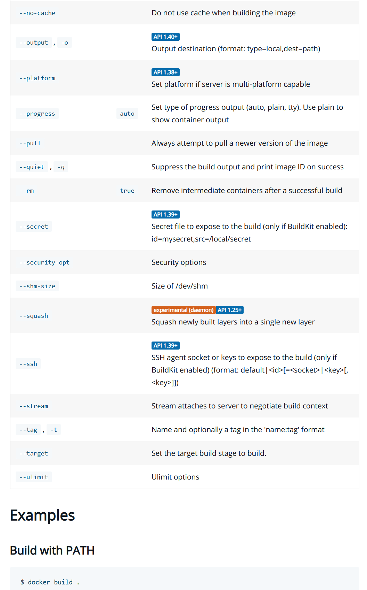

### `buildx`

* Builder antiguo: `DOCKER_BUILDKIT=0 docker build .`
* Builder nuevo: `DOCKER_BUILDKIT=1 docker build .`
* [`docker buildx build .`](https://docs.docker.com/buildx/working-with-buildx/) 👈

😯

notes:

Tenemos tres comandos diferentes para construir una imagen... ¿Es que nos quieren volver locos?


^^^^^^

### `buildx`


`DOCKER_BUILDKIT=0 docker build .`

Este es el más sencillo: si necesitamos utilizar el antiguo builder, esta es la manera de hacerlo.

notes:

Y os preguntaréis... pero si con BuildKit todo son ventajas ¿para qué queremos seguir usando el viejo?

Por ejemplo, porque la [depuración con BuildKit](https://github.com/moby/buildkit/issues/1472) es
especialmente farragosa y con el anterior constructor era muy sencillo de hacer. De hecho, es un 
problema que todavía no se ha solucinado.

^^^^^^

### `buildx`

`DOCKER_BUILDKIT=1 docker build .`

Queremos utilizar el mismo comando de docker [`docker build`](https://docs.docker.com/engine/reference/commandline/build/)

...con la misma sintaxis

...con las mismas opciones que antes

...pero usando BuildKit

notes:

A este comando se le van añadiendo optiones a medida que la API va evolucionando. Por ejemplo:



Aquí vemos un extracto, a fecha de hoy, de la documentación del comando `docker build` en el
que vemos las opciones `--secret`, `--ssh` que se introdujeron junto con el uso de BuildKit
y otras opciones como [`--ouput`](https://docs.docker.com/engine/reference/commandline/build/#custom-build-outputs).

^^^^^^

### `buildx`

¿Y qué pasa si queremos utilizar todas las nuevas funcionalidades que trae `BuildKit`?

_cache export_, 
[uso de múltiples instancias para construcción de imágenes concurrentes](https://docs.docker.com/buildx/working-with-buildx/#work-with-builder-instances), 
[múltiples architecturas](https://docs.docker.com/buildx/working-with-buildx/#build-multi-platform-images)...

notes:

Para eso se ha desarrollado `buildx`: un ejecutable nuevo que nos facilita el acceso a
todas las funciones de BuilKit. En lugar de modificar el comando `docker build` e implementar
en él todas esas funcionalidades dentro de él, han optado por desarrollar un comando nuevo.

^^^^^^

### `buildx`

Si queremos que `buildx` sea el constructor de imágenes por defecto:

```shell [1,5]
$ docker buildx install

$ docker build --help   

Usage:  docker buildx build [OPTIONS] PATH | URL | -

Start a build

Aliases:
  build, b

Options:
...
```

^^^^^^

### `buildx`

Si queremos volver a usar el antiguo comando `docker build`

```shell [1,5]
$ docker buildx uninstall

$ docker build --help   

Usage:  docker build [OPTIONS] PATH | URL | -

Build an image from a Dockerfile

Options:
...
```


