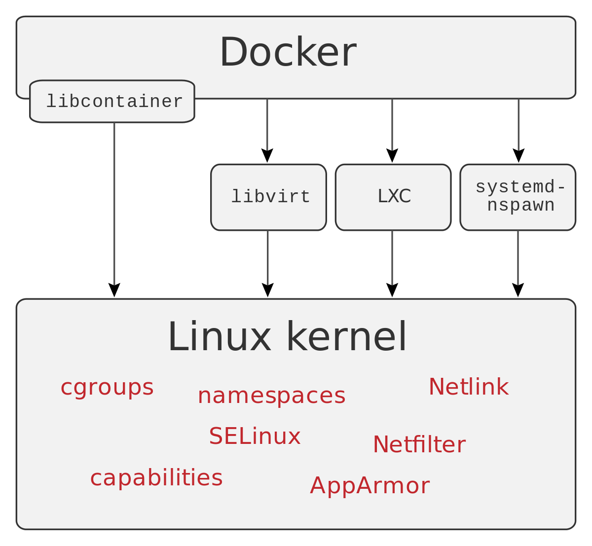

### Docker Ecosystem: 2014 libcontainer

notes:

[`libcontainer`](https://github.com/opencontainers/runc/tree/master/libcontainer) 
es una interfaz de Docker para interactuar con algunas
herramientas de Linux como Cgroups, namespaces, netlink y netfilter

Escrita en Go, esta librería sustituyó a la implementación inicial de Docker
que utilizaba LXC

Actualmente esta librería se incluye dentro del runtime `runc`

^^^^^^

### Docker Ecosystem: 2015 - runC

En 2015, [Docker libera `runC`](https://www.docker.com/blog/runc/), un runtime ligero y portable para la ejecución de contenedores.

En esencia, se trata de un pequeño comando para hacer uso de `libcontainerd`
directamente, sin necesidad de pasar por Docker Engine

^^^^^^

### Docker Ecosystem: 2015 - OCI

Ese mismo año, Docker, junto a CoreOS y otras empresas relacionadas con 
contenedores crean la Open Container Initiative 
([OCI](https://www.opencontainers.org/))

^^^^^^

#### Docker Ecosystem: 2015 - OCI

_The Open Container Initiative
is a lightweight, open governance structure (project), formed under the auspices of the Linux Foundation, for the express purpose of creating open industry standards around container formats and runtime._

^^^^^^
#### Docker Ecosystem: 2015 - OCI

¿Qué se busca conseguir con esta especificación?

* Que los contenedores que no estén ligados a un cliente o sistema de 
  orquestación particular
* Que los contenedores no estén asociados a un determinado fabricante o
  proyecto
* Que los contenedores sean portables entre un amplio abanico de sistemas
  operativos, hardware, arquitecturas de CPU y clouds

^^^^^^
#### Docker Ecosystem: 2015 - OCI

Hasta el momento ha liberado dos especificaciones:
* [runtime-spec](https://github.com/opencontainers/runtime-spec) Especifica la configuración, entorno de ejecución y ciclo de vida de un contenedor
* [image-spec](https://github.com/opencontainers/image-spec) define una imagen, que consiste en un _manifest_, un índice (opcional) un conjunto de capas y una configuration

^^^^^^

#### Docker Ecosystem: 2015 - OCI

Actualmente cuenta entre sus [miembros](https://www.opencontainers.org/about/members) con Facebook, Alibaba Cloud, Amazon Web Services, Google, IBM, Intel, Microsoft entre otros

^^^^^^
#### Docker Ecosystem: 2015 - OCI

Este esfuerzo común por empresas tan potentes del sector por estandarizar
esta tecnología es una indicación de que los contenedores están aquí quedarse

^^^^^^
#### Docker Ecosystem: 2015 - OCI

Si queréis profundizar un poco más en esta iniciativa, las 
[FAQs](https://www.opencontainers.org/faq) son un
buen punto de partida

^^^^^^

#### Docker Ecosystem: 2016 - containerd

Docker continúa su cambio de paradigma (monolito -> componentes) liberando
[`containerd`](https://www.docker.com/blog/what-is-containerd-runtime/)

Es un demonio para Linux y Windows que gestiona el ciclo de vida completo de un contenedor:  transferencia y almacenamiento de imágenes, ejecución y supervisión del contenedor, etc

^^^^^^

### Docker Ecosystem: 2017 - moby

[https://mobyproject.org/](https://mobyproject.org/)

notes:

Este proyecto surgió como iniciativa de Docker y ha evolucionado en 
un framework para desarrollar sistemas de gestión de contenedores.

Facilita componentes para orquestación, gestión de imágenes, configuración,
aprovisionamiento o networking. El objetivo es disponer de librerías para 
no tener que reinventar la rueda cada vez alguien necesita desarrollar un sistema de contenedores.

En [este enlace](https://mobyproject.org/projects/) se puede acceder a algunos de los proyectos desarrollados
por moby, entre los que está BuildKit (del que hemos hablado en el curso)

^^^^^^

#### Docker Ecosystem

Recursos:

* [An Overall View On Docker Ecosystem](https://medium.com/faun/an-overall-view-on-docker-ecosystem-containers-moby-swarm-linuxkit-containerd-kubernetes-5e4972a6a1e8)